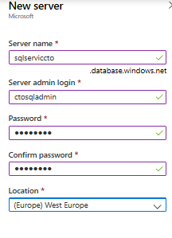
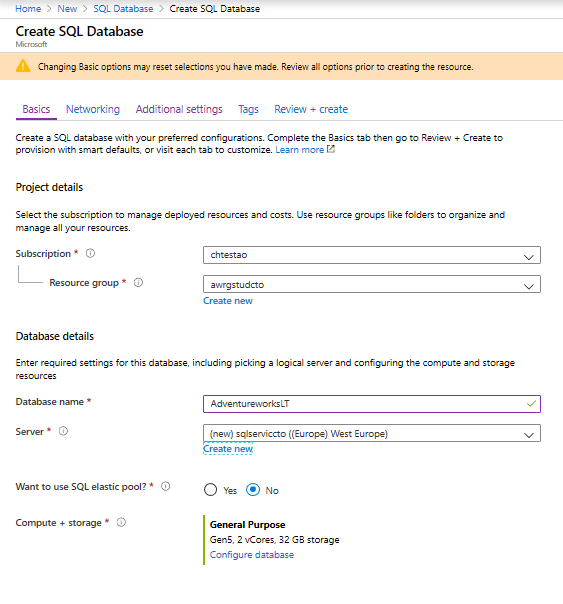
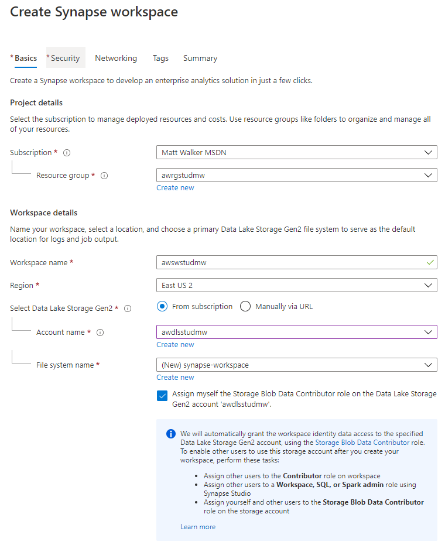

# DP 200 - Implementing a Data Platform Solution
# Lab 5 - Working with Relational Data Stores in the Cloud

**Estimated Time**: 75 minutes

**Pre-requisites**: It is assumed that the case study for this lab has already been read. It is assumed that the content and lab for module 1: Azure for the Data Engineer has also been completed.  Data Lake storage account in Lab 2 must be complete.

**Lab files**: The files for this lab are located in the **Starter** folder.

## Lab overview

The students will be able to provision an Azure SQL Database and Azure Synapse Analytics workspace and be able to issue queries against one of the instances that are created. They will be also be able to integrate a data warehouse with a number of other data platform technologies and use PolyBase to load data from one data source into Azure Synapse Analytics.

## Lab objectives
  
After completing this lab, you will be able to:

1. Use Azure SQL Database
1. Describe Azure Synapse Analytics 
1. Create Azure Synapse Analytics 
1. Use PolyBase to load data into Azure Synapse Analytics 

## Scenario
  
You are the senior data engineer at AdventureWorks, and you are working with your team to transition a relational database system from an on-premises SQL Server to a Azure SQL Database located in Azure. You will begin by creating an instance of Azure SQL Database with the company's sample database. Your intention is to hand this instance of to a junior data engineer to perform some testing of departmental databases.

You will then provision Azure Synapse Analytics server and test that the provisioning of the server is successful. You will then use PolyBase to load a dimension table from Azure Blob to test that the integration of this data platform technology with Azure Synapse Analytics.

At the end of this lad, you will have:

1. Used Azure SQL Database
1. Described Azure Synapse Analytics 
1. Created and queryied Azure Synapse Analytics 
1. Used PolyBase to doad data into Azure Synapse Analytics 

## Exercise 1: Use Azure SQL Database

Estimated Time: 15 minutes

Individual exercise
  
The main task for this exercise are as follows:

1. Create and configure a SQL Database instance.

### Task 1: Create and configure a SQL Database instance.

1. In the Azure portal, navigate to the **+ Create a resource** blade.

1. In the New screen, click the **Search the Marketplace** text box, and type the word **SQL Database**. Click **SQL Database** in the list that appears.

1. In the **SQL Database** screen, click **Create**.

1. From the **Create SQL Database** screen, create an Azure SQL Database with the following settings:

    - In the Project details section, type in the following information
    
        - **Subscription**: the name of the subscription you are using in this lab

        - **Resource group**: **awrgstudxx**, where **xx** are your initials.

    - Click on the  **Additional setting** tab, click **Sample** . The AdventureworksLT sample database is selected automatically. 
    
    - Click the **Basics** tab once this has been done.
    
    - In the Database details section, type in the following information
    
        - Database name: type in **AdventureworksLT**
     
        - Server: Create a new server by clicking **Create new** with the following settings and click on **OK**:
            - **Server name**: **sqlservicexx**, where **xx** are your initials
            - **Server admin login**: **xxsqladmin**, where **xx** are your initials
            - **Password**: **Pa55w.rd**
            - **Confirm Password**: **Pa55w.rd**
            - **Location**: choose a **location** near to you.
            - click on **OK**

                

            - Leave the remaining settings to their defaults, and then click on **OK**
            
    - Under **Compute + storage**, select **Configure database**
        - In **General Purpose**, Select **Serverless**
        > Note: Explore the other options to get more familiar with their configurations.
        
        - click **Apply**

    

1. In the **Create SQL Database** blade, click **Review + create**.

1. After the validation of the **Create SQL Database*** blade, click **Create**.

   > **Note**: The provision will takes approximately 4 minutes.

> **Result**: After you completed this exercise, you have an Azure SQL Database instance

## Exercise 2: Describe Azure Synapse Analytics
  
Estimated Time: 15 minutes

Individual exercise
  
The main tasks for this exercise are as follows:

1. Create and configure a Azure Synapse Analytics instance.

1. Pause the warehouse database

### Task 1: Create and configure a Azure Synapse Analytics instance.

1. In the Azure portal, click on the link **home** at the top left of the screen.

1. In the Azure portal, click **+ Create a resource**.

1. In the New blade, navigate to the **Search the Marketplace** text box, and type the word **Synapse**. Click **Azure Synapse Analytics (workspaces preview)** in the list that appears.

1. In the **Azure Synapse Analytics (workspaces preview)** blade, click **Create**.

1. From the **Basics** blade, create an Azure Synapse Analytics  with the following settings:

    - In the **Project details** section, type in the following information

        - **Subscription**: the name of the subscription you are using in this lab

        - **Resource group**: **awrgstudxx**, where **xx** are your initials.

    - In **Workspace name** section, type the following information

        - **Workspace name**: **awswstudxx**, where **xx** are your initials

        - **Region**: Choose a region near you 

        - Under **Select Data Lake Storage Gen2** > **Account name**: select storage account created in lab 2 **awdlsstudxx**, where **xx** are your intials

        - Under **File system name** click **Create new** and enter **synapse-workspace**

        - Check the option **Assign myself the Storage Blob Data Contributor role on the Data Lake Storage Gen2 account 'awdlsstudxx'.**

            

1. In the **Create Synapse workspace** screen, click **Review + create**.

1. In the **Summary** screen, click **Create**.

    > **Note**: The provision will takes approximately 3 minutes.

### Task 2: Create dedicated SQL pool 

1. In the Azure portal, in the blade, click **Resource groups**, and then click **awrgstudxx**, and then click on **awswstudxx**, where **xx** are your initials

1. Click on **+ New dedicated SQL pool**

    - In the **Basics** section, type in the following

        - **Dedicated SQL pool name**: **dwhservicexx**, where **xx** are your initials
        - **Performance level** **DW100C**

1. In the **Create dedicated SQL pool** screen, click **Review + create**.

1. In the **Review + create** screen, click **Create**.

    > **Note**: The provision will takes approximately 3 minutes.
## Exercise 3: Creating an Azure Synapse Analytics database and tables

Estimated Time: 25 minutes

Individual exercise

The main tasks for this exercise are as follows:

1. Create SQL Data Warehouse tables

    > **Note**: If you are not familiar with Transact-SQL, statements are available for the following labs in the following location **Starter\Lab 5\***

### Task 1: Create a SQL Data Warehouse tables.

1. In the Azure portal, in the blade, click **Resource groups**, and then click **awrgstudxx**, and then click on **awswstudxx**, where **xx** are your initials

1. In the **Overview** section, click the **Workspace web URL** to open Synapse Studio.

1. Open the **Data** menu
    - In the Data blade expand **Databases** and database **dwhservicexx**, where **xx** are your intials should be listed.  
    - On the database Action **...** select **New SQL Script** then **Empty Script**

    > Note: Your dedicated SQL pool must be running for the database to be available.

1. In the script section crate the following tables

- Create a table named **dbo.Users** with a **clustered columnstore** index with a distribution of **replicate** with the following columns:

    | column name | data type | Nullability|
    |-------------|-----------|------------|
    | userId | int | NULL|
    | City | nvarchar(100) | NULL|
    | Region | nvarchar(100) | NULL|
    | Country | nvarchar(100) | NULL|

- Create a table named **dbo.Products** with a **clustered columnstore** index with a distribution of **round robin** with the following columns:

    | column name | data type | Nullability|
    |-------------|-----------|------------|
    | ProductId | int | NULL|
    | EnglishProductName | nvarchar(100) | NULL|
    | Color | nvarchar(100) | NULL|
    | StandardCost | int | NULL|
    | ListPrice | int | NULL|
    | Size | nvarchar(100) | NULL|
    | Weight | int | NULL|
    | DaysToManufacture | int | NULL|
    | Class | nvarchar(100) | NULL|
    | Style | nvarchar(100) | NULL|

-  Create a table named **dbo.FactSales** with a **clustered columnstore** index with a distribution of **Hash** on the **SalesUnit** with the following columns:

    | column name | data type | Nullability|
    |-------------|-----------|------------|
    | DateId | int | NULL|
    | ProductId | int | NULL|
    | UserId | int | NULL|
    | UserPreferenceId | int | NULL|
    | SalesUnit | int | NULL|

1. In the **SQL script** panel click **Run**

    > Insure **Connect to** is **dwhservicexx** and **Use database** is **dwhservicexx**, where **xx** is your initials.

> **Result**: After you completed this exercise, you have opened Synapse Studio to craete three tables named Users, Products and FactSales.

## Exercise 4: Using PolyBase to Load Data into Azure Synapse Analytics 

Estimated Time: 10 minutes

Individual exercise

The main tasks for this exercise are as follows:

1. Collect Data Lake Storage container and key details

1. Create a dbo.Dates table using PolyBase from Azure Data Lake Storage

1. Pause the **dwhservicexx** database

### Task 1: Collect Azure Blob account name and key details

1. In the Azure portal, click on **Resource groups** and then click on **awrgstudxx**, and then click on **awdlsstudxx** where xx are the initials of your name.

1. In the **awdlsstudxx** screen, click **Access keys**. Click on the icon next to the **Storage account name** and paste it into Notepad.

1. In the **awdlsstudxx - Access keys** screen, under **key1**, Click on the icon next to the **Key** and paste it into Notepad.

### Task 2: Create a dbo.Dates table using PolyBase from Azure Blob

1. In the Azure portal, in the blade, click **Resource groups**, and then click **awrgstudxx**, and then click on **awswstudxx**, where **xx** are your initials

1. In the **Overview** section, click the **Workspace web URL** to open Synapse Studio.

1. Open the **Data** menu
    - In the Data blade expand **Databases** and database **dwhservicexx**, where **xx** are your intials should be listed.  
    - On the database Action **...** select **New SQL Script** then **Empty Script**

    > Note: Your dedicated SQL pool must be running for the database to be available.

1. In the script editor type in the following code:

    ```SQL
    CREATE MASTER KEY;
    ```

1. Create a database scoped credential named **AzureStorageCredential** with the following details, by typing in the following code:
    - IDENTITY: **MOCID**
    - SECRET: **The access key of your storage account**

    ```SQL
    CREATE DATABASE SCOPED CREDENTIAL AzureStorageCredential
    WITH
    IDENTITY = 'MOCID',
    SECRET = 'Your storage account key'
    ;
    ```

1. In the **Sql script** editor, highlight both statements and then click on **Run**.

1. In the **Sql script** editor, type in code that will create an external data source named **AzureStorage** for the Blob storage account and data container created in with a type of **HADOOP** that makes use of the ****AzureStorageCredential**. Note that you should replace **awdlsstudxx** in the location key with your storage account with your initials 

    ```SQL
	CREATE EXTERNAL DATA SOURCE AzureStorage
    WITH (
        TYPE = HADOOP,
        LOCATION = 'abfs://data@awdlsstudxx.dfs.core.windows.net',
        CREDENTIAL = AzureStorageCredential
    );
    ```

1. In the **Sql script** editor, type in code that will create an external file format named **TextFile** with a formattype of **DelimitedText** and a filed terminator of **comma**.

    ```SQL
    CREATE EXTERNAL FILE FORMAT TextFile
    WITH (
        FORMAT_TYPE = DelimitedText,
        FORMAT_OPTIONS (FIELD_TERMINATOR = ',')
    );
    ```

1. In the **Sql script** editor, highlight the statement and then click on **Execute**.

1. In the **Sql script** editor, type in code that will create an external table named **dbo.DimDate2External** with the **location** as the root file, the Data source as **AzureStorage**, the File_format of **TextFile** with the following columns:

    | column name | data type | Nullability|
    |-------------|-----------|------------|
    | Date | datetime2(3) | NULL|
    | DateKey | decimal(38, 0) | NULL|
    | MonthKey | decimal(38, 0) | NULL|
    | Month | nvarchar(100) | NULL|
    | Quarter | nvarchar(100) | NULL|
    | Year | decimal(38, 0) | NULL|
    | Year-Quarter | nvarchar(100) | NULL|
    | Year-Month | nvarchar(100) | NULL|
    | Year-MonthKey | nvarchar(100) | NULL|
    | WeekDayKey| decimal(38, 0) | NULL|
    | WeekDay| nvarchar(100) | NULL|
    | Day Of Month| decimal(38, 0) | NULL|

    ```SQL
	CREATE EXTERNAL TABLE dbo.DimDate2External (
    [Date] datetime2(3) NULL,
    [DateKey] decimal(38, 0) NULL,
    [MonthKey] decimal(38, 0) NULL,
    [Month] nvarchar(100) NULL,
    [Quarter] nvarchar(100) NULL,
    [Year] decimal(38, 0) NULL,
    [Year-Quarter] nvarchar(100) NULL,
    [Year-Month] nvarchar(100) NULL,
    [Year-MonthKey] nvarchar(100) NULL,
    [WeekDayKey] decimal(38, 0) NULL,
    [WeekDay] nvarchar(100) NULL,
    [Day Of Month] decimal(38, 0) NULL
    )
    WITH (
        LOCATION='/DimDate2.txt',
        DATA_SOURCE=AzureStorage,
        FILE_FORMAT=TextFile
    );
    ```

1. In the **Sql script** editor, highlight the statement and then click on **Run**.

1. Test that the table is created by running a select statement against it

    ```SQL
    SELECT * FROM dbo.DimDate2External;
    ```

1. In the **Sql script** editor, type in a **CTAS** statement that creates a table named **dbo.Dates** with a **columnstore** index and a **distribution** of **round robin** that loads data from the **dbo.DimDate2External** table.

    ```SQL
    CREATE TABLE dbo.Dates
    WITH
    (   
        CLUSTERED COLUMNSTORE INDEX,
        DISTRIBUTION = ROUND_ROBIN
    )
    AS
    SELECT * FROM [dbo].[DimDate2External];
    ```

1. In the **Sql script** editor, highlight the statement and then click on **Run**.
 
1. In the **Sql script** editor, type in a query that creates statistics on the **DateKey**, **Quarter** and **Month** column.

    ```SQL
    CREATE STATISTICS [DateKey] on [Dates] ([DateKey]);
    CREATE STATISTICS [Quarter] on [Dates] ([Quarter]);
    CREATE STATISTICS [Month] on [Dates] ([Month]);
    ```

1. Test that the table is created by running a select statement against it

    ```SQL
    SELECT * FROM dbo.Dates;
    ```
### Task 3: Pause the dwhservicexx database

1. In Synapse Studio, navigate to the **Manage** menu.

1. Under **Analytics pools**, select **SQL pools**.

1. Hover over on **dwhservicexx**, where **xx** are your initials, then click the **Pause** icon.

1. In the Pause **dwhservicexx** screen, click **Yes**
