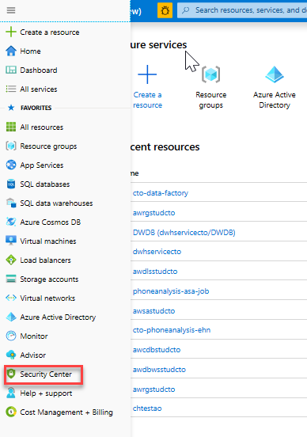
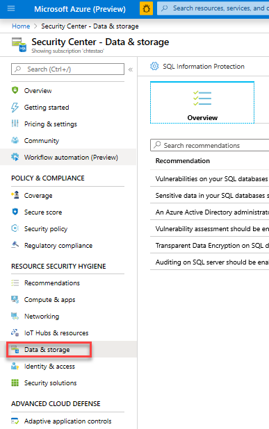
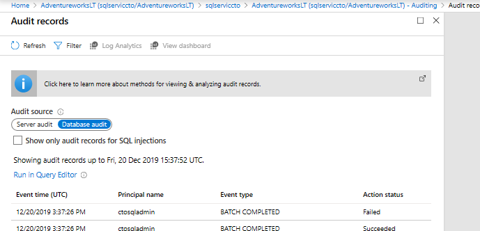

# DP 200 - Implementing a Data Platform Solution
# Lab 8 - Securing Azure Data Platforms

**Estimated Time**: 75 minutes

**Pre-requisites**: It is assumed that the case study for this lab has already been read. It is assumed that the content and lab for module 1 to module 7 has been completed.

**Lab files**: The files for this lab are located in the **Starter** folder.

## Lab overview

The students will be able to describe and document the different approaches to security that can be taken to provide defence in depth. This will involve the student documenting the security that has been set up so far in the course. It will also enable the students to identify any gaps in security that may exists for AdventureWorks.

## Lab objectives
  
After completing this lab, you will be able to:

1. Explain Security
1. Describe key security components
1. Secure Storage Accounts and Data Lake Storage
1. Secure Data Stores
1. Secure Streaming Data

## Scenario
  
As a senior data engineer within AdventureWorks, you are responsible for ensuring that your data estate is secured. You are performing a security check of your current infrastructure to ensure that you have diligently placed security where it is required. This check should be a holistic check of all the services and data that you have created so far, and an identification of any gaps that there may be in the configuration of the security. 

You have also been asked to tighten up the security of the SQL Database DeptDatabasesxx and have been asked to setup auditing against the database so that you can monitor access to the database. Furthermore, you have learned that that the Manage permission for your event hub is not restrictive enough, and you want to remove this permission.

At the end of this lad, you will have:

1. Explained Security
1. Described key security components
1. Secured Storage Accounts and Data Lake Storage
1. Secured Data Stores
1. Secured Streaming Data

## Exercise 1: An introduction to security

Estimated Time: 15 minutes

Group exercise
  
The main task for this exercise are as follows:

1. Security as a layered approach.

1. The instructor will discuss the findings with the group.

### Task 1: Security as a layered approach.

1. From the lab virtual machine, start **Microsoft Word**, and open up the file **DP-200-Lab08-Ex01.docx** from the **Starter** folder.

1. From the course content, case study and the scenarios taken in the course so far, spend **10 minutes** in a group identifying the layers of security that you have impacted so far to secure AdventureWorks in the labs. Find three examples.

### Task 2: Discuss the findings with the Instructor

1. The instructor will stop the group to discuss the findings.

> **Result**: After you completed this exercise, you have created a Microsoft Word document that contains at least three examples of how you have implemented security at Adventureworks and which layer of security you have impacted.

## Exercise 2: Key security components
  
Estimated Time: 10 minutes

Individual exercise
  
The main tasks for this exercise are as follows:

1. Assessing Data and Storage Security Hygiene

### Task 1: Assessing Data and Storage Security Hygiene.

1. In the Azure portal tab, click **Security Center**.

    

1. In the Security Center - Overview screen, under **Resource Security Hygiene**, click Data and Storage.

    

1. Identify the top two key data and storage components that require attention.

    1. __Answers may vary_____
    1. __Answers may vary_____

> **Result**: After you completed this exercise, you have learned where you can look to identify any data and storage security weaknesses that is in your Azure subscription.

## Exercise 3: Securing Storage Accounts and Data Lake Storage
  
Estimated Time: 15 minutes

Individual exercise
  
The main tasks for this exercise are as follows:

1. Determining the appropriate security approach for Azure Blob

1. Discuss the findings with the Instructor

### Task 1: Determining the appropriate security approach for Azure Blob

1. You have been approached by your in-house web developer to help give access to a third party web design company to the web images that are in the awsastudxx storage account. As a senior data engineer within AdventureWorks, what steps would you need to take to ensure this can happen while applying the correct due diligence.

1. From the lab virtual machine, start **Microsoft Word**, and open up the file **DP-200-Lab08-Ex03.docx** from the **Starter** folder.

### Task 2: Discuss the findings with the Instructor

1. The instructor will stop the group to discuss the findings.

> **Result**: After you completed this exercise, you have created a Microsoft Word document that contains the steps that you would take to provide secure access to a Blob storage account to a third-party web development company.

## Exercise 4: Securing Data Stores
  
Estimated Time: 15 minutes

Individual exercise
  
The main tasks for this exercise are as follows:

1. Enabling Auditing

1. Query the Database

1. View the Audit log

### Task 1: Enabling Auditing

1. In the Azure portal, in the blade, click **Resource groups**, and then click **awrgstudxx**, and then click on **awdlsstudxx**, where **xx** are your initials

1. In the Azure portal, in the blade, click Resource groups, and then click awrgstudxx, and then click on **AdventureWorksLT**.

1. In the deptdatabasesxx (sqlservicexx/AdventureWorksLT) screen, click on the **Auditing** blade.

1. Under **Auditing**, click on the **ON** button.

1. Select the checkbox next to **Storage**.

1. Click on **Storage Details - Configure**.

1. In the **Storage Setting** screen, click **Subscription - change storage subscription**, and then click your subscription.

1. In the **Storage Setting** screen, click **Storage Settings - Configure required settings**. In the **Choose storage account** screen, click **awsastudxx**

1. In the **Retention Days** text box, type **90**, and then click on **OK**.

    

1. Click on **Save**.

### Task 2: Query the database

1. On the windows desktop, click on the **Start**, and type **"SQL Server"** and then click on **MIcrosoft SQL Server Management Studio 17**

1. In the **Connect to Server** dialog box, fill in the following details
    - Server Name: **sqlservicexx.database.windows.net**
    - Authentication: **SQL Server Authentication**
    - Username: **xxsqladmin**
    - Password: **P@ssw0r**

1. In the **Connect to Server** dialog box, click **Connect** 

> **Note**: An error message is returned as the password is incorrect. Type in the correct password of **P@Ssw0rd**.

1. Type in the correct password of **Pa55w.rd**

1. In **SQL Server Management Studio**, in Object Explorer, expand **AdventureWorksLT**, and then expand **Tables**.

1. Right click [SalesLT].[Customers] and then click **Select Top 1000 Rows**

### Task 2: View the Audit Log

1. Return to the Azure Portal. In the AdventureWorksLT (sqlservicexx/AdventureWorksLT) - Auditing screen, click on **View Audit Logs**

1. Note in the **Audit records** log file the **Failed Authentication** record. Close down the **Audit records** screen

    

> **Result**: After you completed this exercise, you have enabled database auditing and verified that the auditing works.

## Exercise 5: Securing Streaming Data
  
Estimated Time: 15 minutes

Individual exercise
  
The main tasks for this exercise are as follows:

1. Changing Event Hub Permissions

### Task 1: Changing Event Hub Permissions

1. In the Azure portal, in the blade, click **Resource groups**, and then click **awrgstudxx**, and then click on **xx-phoneanalysis-ehn**, where **xx** are your initials

1. In the Azure portal, in the **xx-phoneanalysis-ehn**, where **xx** are your initials. Scroll to the bottom of the window, and click on **xx-phoneanalysis-eh** event hub.

1. To grant access to the event hub, click **Shared access policies**.

1. Under the **xx-phoneanalysis-eh - Shared access policies** screen, click on **phoneanalysis-eh-sap**.

1. Click on the checkbox next to the **Manage** permissions to remove it, and then click **Save**.

1. In the Azure portal, in the blade, click **Home**,

> **Result**: After you completed this exercise, you modified the security of an Event Hub Shared Access Policy.